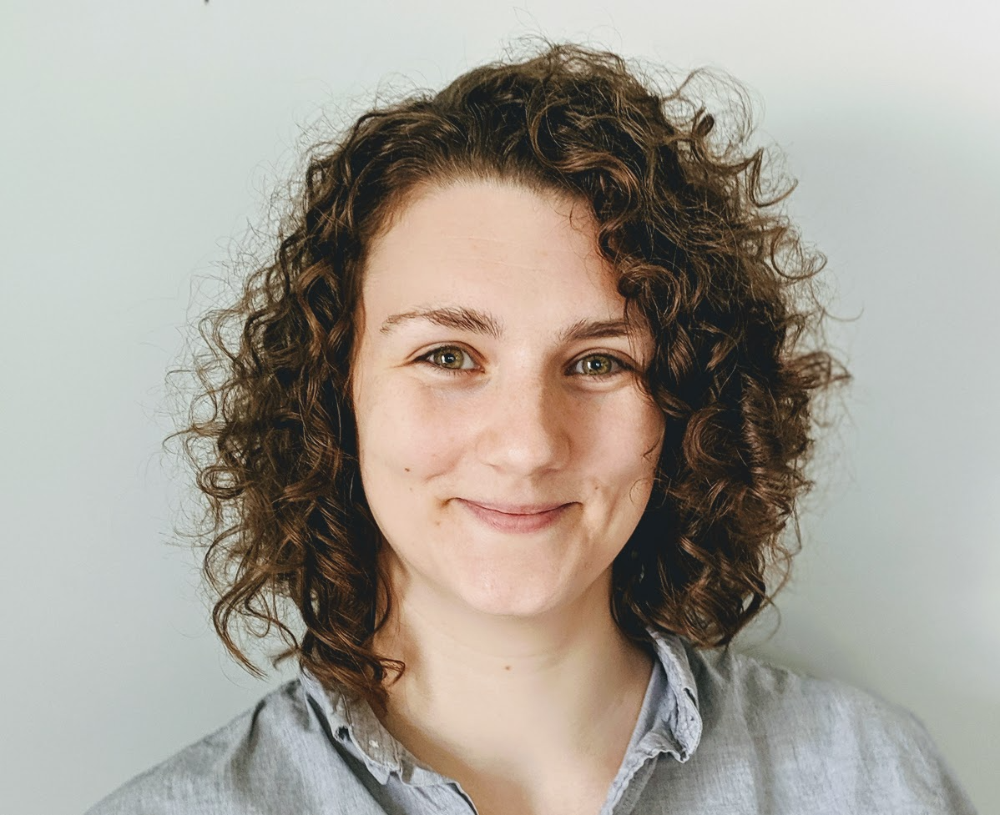

5th year PhD Candidate
Developmental Psychology
Duke University

I study lexical and phonological variability in infants' linguistic environments and how they overcome it to learn their first words. I do this with corpus analysis and eye tracking. My work is supervised by [https://psychandneuro.duke.edu/people/elika-bergelson](Elika Bergelson).

## Research
### Publications
### CV
## Teaching
## Contact
